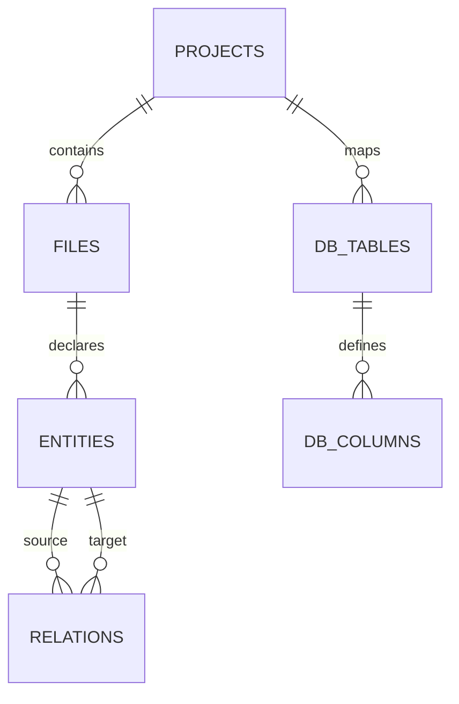

# Session Handover Compact Handbook - Scanners & Catalog Platform

This document serves as the ultimate, zero-friction developer handover context. It details the exact schemas, codebase components, parsers, APIs, and UI designs. Reading this file aligns any developer or agent to resume work immediately.

---

## 1. Project Directory & File Inventory

All code and configurations reside inside the `/src` directory, referencing the SQLite database file at `src/metadata.db`.

| Path | Language | Purpose | Key Files |
| :--- | :--- | :--- | :--- |
| **`src/HoangTLM.CodeBase.DatabaseScanner/`** | C# | SQL Server Schema Analyzer | [SqliteRepository.cs](file:///Users/minhhoang/Repos/ProjectScaner/src/HoangTLM.CodeBase.DatabaseScanner/Sqlite/SqliteRepository.cs), [SqlServerScanner.cs](file:///Users/minhhoang/Repos/ProjectScaner/src/HoangTLM.CodeBase.DatabaseScanner/SqlServer/SqlServerScanner.cs) |
| **`src/HoangTLM.CodeBase.DatabaseScanner.App/`** | C# | Database Scanner Runner | [Program.cs](file:///Users/minhhoang/Repos/ProjectScaner/src/HoangTLM.CodeBase.DatabaseScanner.App/Program.cs), [App.config](file:///Users/minhhoang/Repos/ProjectScaner/src/HoangTLM.CodeBase.DatabaseScanner.App/App.config) |
| **`src/HoangTLM.CodeBase.DatabaseScanner.Api/`** | C# | Backend ASP.NET Core API | [Program.cs](file:///Users/minhhoang/Repos/ProjectScaner/src/HoangTLM.CodeBase.DatabaseScanner.Api/Program.cs), [appsettings.json](file:///Users/minhhoang/Repos/ProjectScaner/src/HoangTLM.CodeBase.DatabaseScanner.Api/appsettings.json) |
| **`src/HoangTLM.CodeBase.DatabaseScanner.Web/`** | Angular | UI Explorer & ERD Canvas | [app.component.ts](file:///Users/minhhoang/Repos/ProjectScaner/src/HoangTLM.CodeBase.DatabaseScanner.Web/src/app/app.component.ts), [app.component.html](file:///Users/minhhoang/Repos/ProjectScaner/src/HoangTLM.CodeBase.DatabaseScanner.Web/src/app/app.component.html) |
| **`src/HoangTLM.CodeBase.DotNetScanner/`** | C# | C# Compiler AST Scanner | [RoslynCodeParser.cs](file:///Users/minhhoang/Repos/ProjectScaner/src/HoangTLM.CodeBase.DotNetScanner/Parsers/RoslynCodeParser.cs), [DotNetSqliteRepository.cs](file:///Users/minhhoang/Repos/ProjectScaner/src/HoangTLM.CodeBase.DotNetScanner/Sqlite/DotNetSqliteRepository.cs) |
| **`src/HoangTLM.CodeBase.DotNetScanner.App/`** | C# | C# Scanner Runner App | [Program.cs](file:///Users/minhhoang/Repos/ProjectScaner/src/HoangTLM.CodeBase.DotNetScanner.App/Program.cs), [App.config](file:///Users/minhhoang/Repos/ProjectScaner/src/HoangTLM.CodeBase.DotNetScanner.App/App.config) |
| **`src/HoangTLM.CodeBase.WebScanner/`** | Node.js | Angular TS & HTML Scanner | [ts-parser.ts](file:///Users/minhhoang/Repos/ProjectScaner/src/HoangTLM.CodeBase.WebScanner/src/parsers/ts-parser.ts), [html-parser.ts](file:///Users/minhhoang/Repos/ProjectScaner/src/HoangTLM.CodeBase.WebScanner/src/parsers/html-parser.ts), [db-repo.ts](file:///Users/minhhoang/Repos/ProjectScaner/src/HoangTLM.CodeBase.WebScanner/src/sqlite/db-repo.ts) |

---

## 2. SQLite Database Catalog Schema (`src/metadata.db`)

All catalog tables use deterministic SHA-256 strings as Primary/Foreign Keys for clean cross-project references.



### Table Specifications:

1. **`projects`**:
   - `id` (TEXT, PK): SHA-256 Hash of `ProjectName`.
   - `parent_id` (TEXT, FK references `projects.id`): Supports tree hierarchy configurations.
   - `name` (TEXT): Project or Solution name.
   - `path` (TEXT): Root folder or Solution path.
   - `type` (TEXT): `Solution` | `Folder` | `Database`.
   - `language` (TEXT): `C#` | `Angular/JS` | `SQL`.
   - `scanned_at` (DATETIME): Timestamp of last synchronization.
   - `description` (TEXT): Scanned profile description.

2. **`files`**:
   - `id` (TEXT, PK): SHA-256 of `ProjectID + ":" + RelativePath`.
   - `project_id` (TEXT, FK references `projects.id`): Back-reference.
   - `relative_path` (TEXT): Slash-normalized path relative to project folder.
   - `absolute_path` (TEXT): Complete disk path.
   - `description` (TEXT): File annotation.

3. **`db_tables`**:
   - `id` (TEXT, PK): SHA-256 of `ProjectID + ":" + schema + "." + tableName`.
   - `project_id` (TEXT, FK references `projects.id`).
   - `name` (TEXT): SQL table name.
   - `schema_name` (TEXT): Table schema (e.g. `dbo`).
   - `database_name` (TEXT): Table database (e.g. `SampleDB`).
   - `description` (TEXT): Description/documentation comment.
   - `metadata` (TEXT): JSON containing Foblex Flow coordinates: `{"x": 100, "y": 200}`.

4. **`db_columns`**:
   - `id` (TEXT, PK): SHA-256 of `TableID + ":" + columnName`.
   - `table_id` (TEXT, FK references `db_tables.id`).
   - `name` (TEXT): Column name.
   - `data_type` (TEXT): SQL Data Type (e.g. `nvarchar(255)`).
   - `max_length` (INTEGER): String length.
   - `is_nullable` (INTEGER): `0` (NOT NULL) | `1` (NULL).
   - `is_primary_key` (INTEGER): `0` | `1`.
   - `is_foreign_key` (INTEGER): `0` | `1`.
   - `fk_table` (TEXT): Reference target table.
   - `fk_column` (TEXT): Reference target column.
   - `default_val` (TEXT): Default value binding.
   - `description` (TEXT): Column comment.

5. **`entities`**:
   - `id` (TEXT, PK): SHA-256 of `ProjectID + ":" + type + ":" + fullName`.
   - `file_id` (TEXT, FK references `files.id`).
   - `name` (TEXT): Entity identifier.
   - `type` (TEXT): `StoredProcedure` | `Function` | `Trigger` | `store` | `class` | `interface` | `method` | `enum` | `const` | `endpoint` | `queue` | `schedule` | `component` | `service` | `directive` | `html-element` | `event-binding` | `property-binding`.
   - `signature` (TEXT): C#/TS/SQL signature or verb route definition.
   - `start_line` (INTEGER): Code block starting line (1-indexed).
   - `end_line` (INTEGER): Code block ending line.
   - `metadata` (TEXT): JSON string containing original source code: `{"code": "..."}`.
   - `description` (TEXT): Manual documentation comment.

6. **`relations`**:
   - `id` (TEXT, PK): SHA-256 of `SourceEntityID + ":" + TargetEntityID`.
   - `source_entity_id` (TEXT, FK references `entities.id`).
   - `target_entity_id` (TEXT, FK references `entities.id`).
   - `type` (TEXT): `event-binding` | `calls` | `references`.
   - `metadata` (TEXT): JSON details (e.g., `{ "event": "click", "handler": "..." }`).
   - `description` (TEXT): Relation comment.

7. **`fts_entities` (FTS5 Virtual Table)**:
   - Synchronized virtual table utilizing SQLite FTS5 for high-speed catalog searches:
     ```sql
     CREATE VIRTUAL TABLE fts_entities USING fts5(id UNINDEXED, name, type, signature, description);
     ```

### Database Auto-Synchronization Triggers:
Defined on `entities` table to keep the `fts_entities` search index updated automatically:
- **Insert Trigger**:
  ```sql
  CREATE TRIGGER trg_entities_after_insert AFTER INSERT ON entities BEGIN
      INSERT INTO fts_entities (id, name, type, signature, description)
      VALUES (NEW.id, NEW.name, NEW.type, NEW.signature, NEW.description);
  END;
  ```
- **Update Trigger**:
  ```sql
  CREATE TRIGGER trg_entities_after_update AFTER UPDATE ON entities BEGIN
      UPDATE fts_entities SET name = NEW.name, type = NEW.type, signature = NEW.signature, description = NEW.description WHERE id = NEW.id;
  END;
  ```
- **Delete Trigger**:
  ```sql
  CREATE TRIGGER trg_entities_after_delete AFTER DELETE ON entities BEGIN
      DELETE FROM fts_entities WHERE id = OLD.id;
  END;
  ```

---

## 3. Scanner Components Details

### A. C# Scanner (`DotNetScanner`)
1. **Roslyn Compilation Parser**:
   - Iterates recursively over all `.csproj` files found in the Solution folder.
   - For each file, parses all `.cs` files (ignoring `/obj/`, `/bin/`, `/Properties/`).
   - Reads syntax trees (`CSharpSyntaxTree.ParseText`).
   - Matches:
     - `ClassDeclarationSyntax`: extracts classes, checks if they are controllers, hosted background services, or RabbitMQ consumers.
     - `InterfaceDeclarationSyntax`: extracts interfaces.
     - `EnumDeclarationSyntax`: extracts enums and members list.
     - `FieldDeclarationSyntax`: checks if `Modifiers` contains `const` to extract hằng số.
     - `MethodDeclarationSyntax`: extracts methods and parameter lists.
     - `InvocationExpressionSyntax` in `Program.cs`: maps Minimal APIs (`MapGet`, `MapPost`), RabbitMQ Queues (`QueueDeclare`), and Hangfire Recurring Jobs (`AddOrUpdate`).
2. **Upsert Sync**:
   - Compares the scanned entity signatures with the existing rows.
   - If the signature or line range changed, updates the DB fields.
   - **Important**: Does not write to or delete the `description` column, keeping user docs safe.
3. **Obsolete Pruner**:
   - Cleans up C# entities that no longer exist in the code base.
   - Cleans up orphan files.

### B. Frontend Scanner (`WebScanner`)
1. **TypeScript Parser (`ts-morph`)**:
   - Uses `ts-morph` AST engine to parse Angular component classes.
   - Resolves component selectors and `templateUrl` relative templates paths.
   - Indexes services (`@Injectable`), components (`@Component`), and methods.
2. **HTML Template Parser (`parse5`)**:
   - Uses `parse5` to parse component HTML templates as fragments.
   - Traverses DOM elements to locate Angular property bindings `[prop]`, structural directives `*ngIf`, and event bindings `(click)`.
   - Resolves the exact element positions using the `sourceCodeLocationInfo` feature.
3. **HTML Event to TypeScript Method Linker**:
   - For event bindings like `(click)="onButtonClick($event)"`, applies the regex: `^([a-zA-Z0-9_$]+)\s*\(`.
   - Matches the handler method name (`onButtonClick`).
   - Resolves its ID hash in `entities` table:
     `MethodID = SHA256(ProjectID + ":method:" + Namespace + "." + ComponentClass + ".onButtonClick")`
   - Creates a connection link record inside the `relations` table.
4. **SQLite Sync Repository**:
   - Connects to SQLite using the native async `sqlite` + `sqlite3` packages.
   - Coordinates file checking, entity upserting, relation upserting, and cleanups.

---

## 4. Web API Specifications (`Program.cs`)

Exposed on port **5080** via `Kestrel`. It runs cascade transactions on SQLite:
- `GET /api/projects`: Fetches database scan profiles.
- `GET /api/schema/{projectId}`: Retrieves tables and columns.
- `GET /api/routines/{projectId}`: Fetches SQL Stored Procedures, Functions, Triggers, and store endpoints.
- `GET /api/context/{projectId}`: Returns all static analysis context entities (classes, methods, enums, components, event bindings) matching the project ID.
- `PUT /api/tables/{tableId}/layout`: Saves table coordinate layout metadata.
- `PUT /api/tables/{tableId}/description`: Updates table description.
- `PUT /api/columns/{columnId}/description`: Updates column description.
- `PUT /api/entities/{entityId}/description`: Updates class/method/endpoint description.
- `DELETE /api/projects/{projectId}`: Cascade deletes a project, its files, db_tables, db_columns, entities, and relations.
- `DELETE /api/tables/{tableId}`: Deletes a database table and its columns.
- `DELETE /api/entities/{entityId}`: Deletes a code entity and its relationship links.

---

## 5. Angular Client Component Structure (`HoangTLM.CodeBase.DatabaseScanner.Web`)

- **State variables**:
  - `projects`, `selectedProjectId`: active project.
  - `allTables`: complete project schema.
  - `displayedTables`, `connections`: visible tables on the canvas.
  - `routines`, `contextEntities`: lists for Database and Code tree nodes.
  - `selectedTreeItem`: Tree node selected (`type: 'table' | 'routine'`).
  - `selectedElementType`, `selectedTable`, `selectedColumn`: documentation sidebar state.
  - `showProjectManagerModal`: Manage modal flag.
- **Tree Node Rendering**:
  - `Database tree`: `Tables`, `Procedures`, `Triggers`, `Functions`.
  - `BE tree`: `Classes & Interfaces`, `Methods`, `Enums & Constants`, `API Endpoints`, `Queues`, `Schedules`.
  - `FE tree`: `Components & Directives`, `Services`, `HTML Elements`, `HTML Bindings`.
- **Canvas / Code Viewer swap**:
  - When `selectedTreeItem?.type === 'table'`, the central area shows the Foblex Flow canvas with FK connection ports.
  - When `selectedTreeItem?.type === 'routine'`, swaps canvas out for a SQL/C#/TS/HTML Code Editor viewer displaying source code.
- **Project Manager**:
  - Header button triggering a modal layout to list and delete project profiles.
- **Pruning Trigger**:
  - Right sidebar bottom Danger Zone button calling `deleteSelectedItem()` to prune elements from SQLite.
